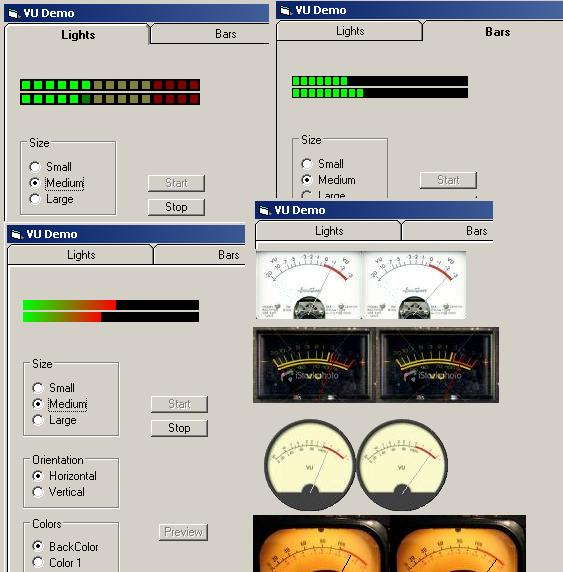



## VU Project

### Description

Here's one for those of you who like to

write music apps, players, etc. A VU

meter on your app makes it a little more

professional looking at least IMO. The

class used to get the Left/Right volume

levels was written by Arne Elster (rm_code)

so I take no credit for that. Also the

gradient functions were written by another

programmer, don't know who, but it is a

good one. Take note, this app won't show

you much unless you have sounds coming from

the soundcard, e.g. Winamp, WMP, Mike, CD

or whatever. If you have difficulty getting

sound levels, try this. With the demo running,

right click on your Volume icon &amp; select Open

Volume Control. Or try Control Panel|Sounds|

Volume tab then Device Volume, click Advanced.

If neither of those are available, try to

run the app directly. On my machine it

is C:\WINDOWS\system32\sndvol32.exe. With

that open, select Options|Properties and

select the Recording option button &amp; click

OK. Now you have the sliders for the various

record options. Try selecting different record

devices and changing the volume levels for these

(note you have to click the Select checkbox below

the slider for it to have any effect) and see

if you get results in the demo app.
 
### More Info
 

             |
---                |---
**Submitted On**   |2009-10-09 10:20:10
**By**             |[Norm Cook](https://github.com/Planet-Source-Code/PSCIndex/blob/master/ByAuthor/norm-cook.md)
**Level**          |Advanced
**User Rating**    |5.0 (50 globes from 10 users)
**Compatibility**  |VB 6\.0
**Category**       |[Sound/MP3](https://github.com/Planet-Source-Code/PSCIndex/blob/master/ByCategory/sound-mp3__1-45.md)
**World**          |[Visual Basic](https://github.com/Planet-Source-Code/PSCIndex/blob/master/ByWorld/visual-basic.md)
**Archive File**   |[VU\_Project2164721092009\.zip](https://github.com/Planet-Source-Code/norm-cook-vu-project__1-72516/archive/master.zip)

